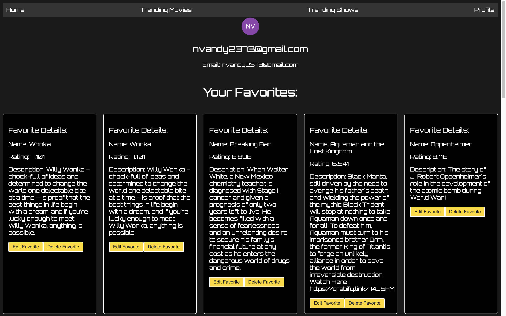
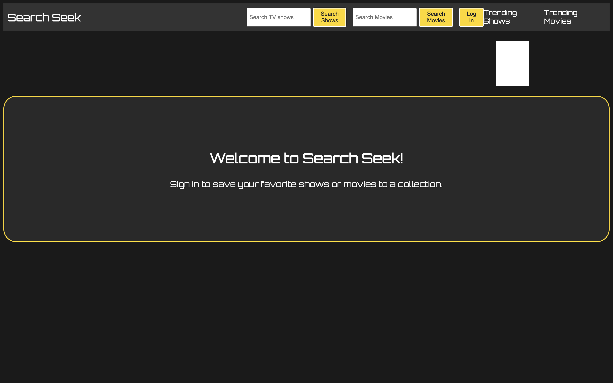
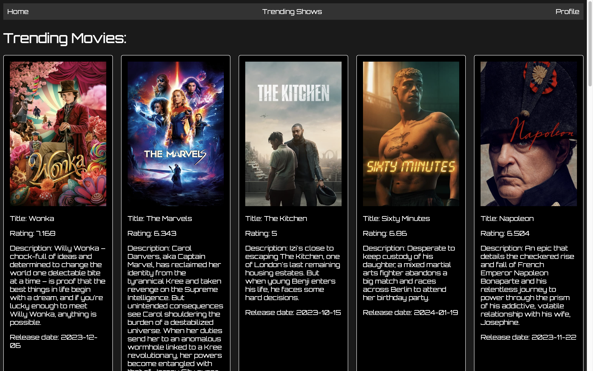
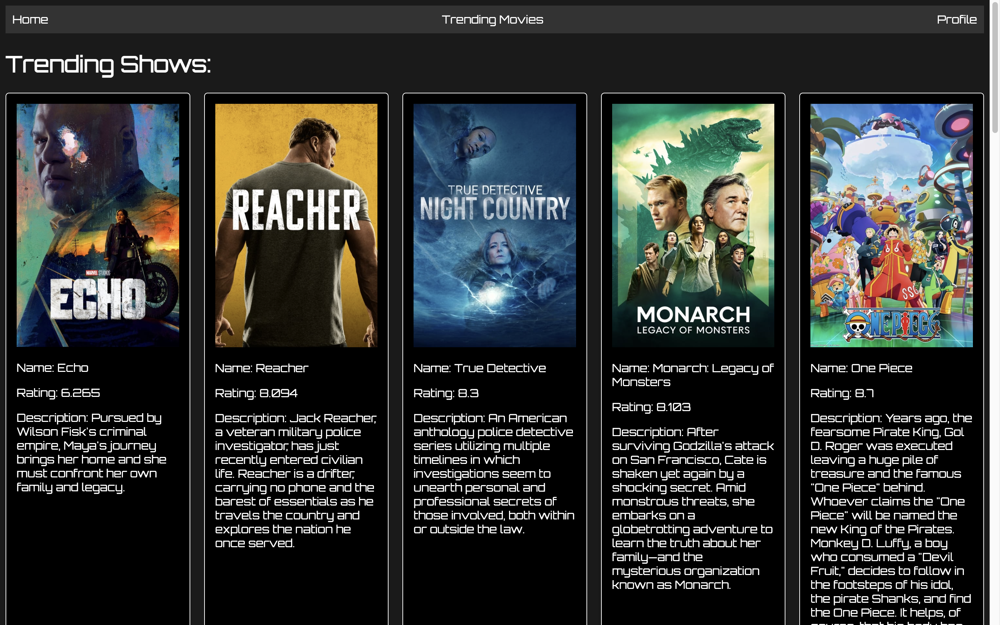
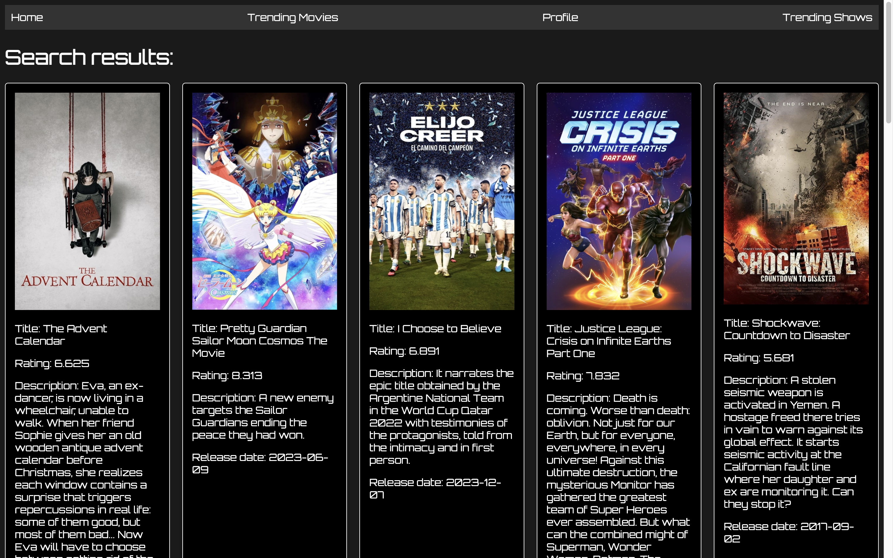

# Welcome to Stream Seek!
Stream Seek is a movie and TV show app designed to provide an immersive entertainment experience. Explore a vast collection of movies and TV shows, powered by the TMDb API. Whether you're a cinephile or a TV series enthusiast, Stream Seek has you covered.

## Check out the app!
[Stream Seek](https://stream-seek-capstone-frontend-pfpu-l603o6n9d.vercel.app/).

## My Trello board
[Trello board](https://trello.com/b/AJ18sO4h/project-4).

## Screenshots
### Profile page

### Title screen

### Trending movies page

### Trending shows page

### Search shows

### Search movies

# Technologies used:
- Node.js
- Express
- MongoDB
- HTML 5 
- CSS 
- TMDB API
- OAuth

# Acknowledgements:
I extend my sincere gratitude to the TMDb API for providing a rich source of movie and TV show data, enabling me to create a dynamic and engaging streaming experience.

# Icebox Features (Scheduled for Future Implementation):
- Sort functionality by rating or alphabetical order.
- Ability to like a trending movie or TV show.
- Mobile responsiveness
- Display additional details on each card. (Ex: Cast)

